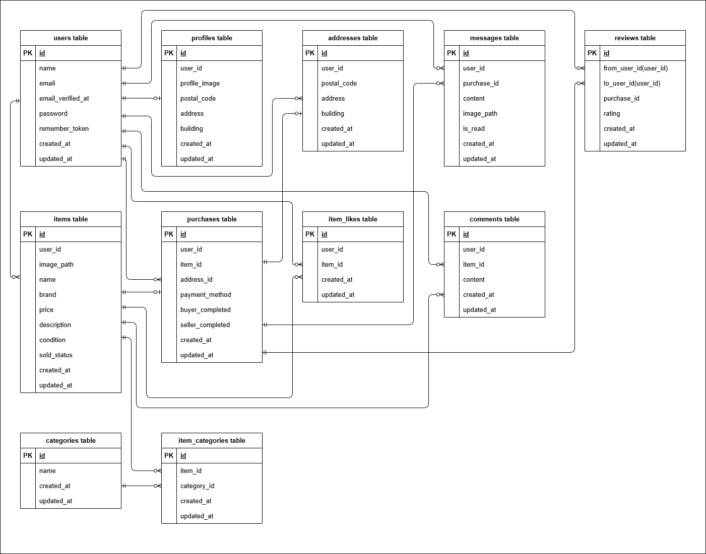

# coachtechフリマ（フリマアプリ）

## 概要
このプロジェクトは、Laravelを使用したフリマアプリです。  
Dockerを利用した環境構築が可能で、MySQLデータベースを使用しています。  
ユーザー登録、ログイン、商品一覧の表示、購入手続き、コメント機能に加え、  
取引チャット、通知、取引後の相互評価などフリマアプリに必要な機能を実装しています。

## 環境構築

### **Dockerビルド**

1. リポジトリをクローン
   ```bash
   git clone git@github.com:mmisa33/flea-market-app.git
2. プロジェクトフォルダに移動
    ```bash
    cd flea-market-app
3. Dockerコンテナをビルドして起動
    ```bash
    docker-compose up -d --build
> **⚠ 注意**  
> MySQLはOSによって起動しない場合があるので、それぞれのPCに合わせて `docker-compose.yml` ファイルを編集してください。

### **Laravel環境構築**

1. PHPコンテナに入る
    ```bash
    docker-compose exec php bash
2. 必要な依存関係をインストール
    ```bash
    composer install
3. .env.example ファイルから .env を作成
    ```bash
    cp .env.example .env
4. .env ファイルの環境変数を変更
    ```bash
    # データベース設定
    DB_CONNECTION=mysql
    DB_HOST=mysql
    DB_PORT=3306
    DB_DATABASE=laravel_db
    DB_USERNAME=laravel_user
    DB_PASSWORD=laravel_pass

    # MailHog設定（開発用メール確認ツール）
    MAIL_MAILER=smtp
    MAIL_HOST=mailhog
    MAIL_PORT=1025
    MAIL_USERNAME=null
    MAIL_PASSWORD=null
    MAIL_ENCRYPTION=null
    MAIL_FROM_ADDRESS=no-reply@example.com
    MAIL_FROM_NAME="FleaMarketApp"

    # Stripe設定 (テスト用APIキーを使用)
    STRIPE_KEY=[pk_test_XXXXXXXXXXXXXXXXX]  # []に取得した公開可能キーを記載
    STRIPE_SECRET=[sk_test_XXXXXXXXXXXXXXXXX]  # []に取得した秘密キーを記載
5. アプリケーションキーを生成
    ```bash
   php artisan key:generate
6. データベースをマイグレーション
    ```bash
    php artisan migrate
7. データベースに初期データを挿入
    ```bash
    php artisan db:seed
    ```
    > **💡 補足**
    > - `CategoriesTableSeeder` は、アプリの動作に必須のカテゴリーデータを挿入するため、**必ず実行が必要**です。
    > - `UsersTableSeeder` や `ItemsTableSeeder` など、その他のシーダーは、アプリを実際に使用しているように見せる**サンプルデータ**を挿入します。
    > - 本番環境では `CategoriesTableSeeder` のみを使い、他は開発やテスト時に利用することを想定しています。
8. ストレージリンクを作成（画像表示に必要）
    ```bash
    php artisan storage:link
    ```
    > **💡 補足**
    > - ホームページで使用する固定画像は `public/images` に配置されているため、そのまま表示されます。
    > - 商品やユーザーがアップロードした画像は `storage/app/public` に保存されるため、リンク作成が必要です。


## サンプルアカウント（ログイン用）

本アプリには、`UsersTableSeeder`にあらかじめメール認証済みのログイン用ユーザーが3名登録されています。  
開発時や動作確認にご利用ください。

- ログインURL：[http://localhost/login](http://localhost/login)

### 🔐 サンプルユーザー情報

 - **田中 太郎**（商品1～5を出品）
   - Email: `taro@example.com`
   - Password: `password123`
 - **鈴木 次郎**（商品6～10を出品）
   - Email: `jiro@example.com`
   - Password: `password123`
 - **佐藤 花子**（出品商品なし）
   - Email: `hanako@example.com`
   - Password: `password123`

## 使用技術
- PHP 7.4.9
- Laravel 8.83.8
- MySQL 10.3.39 (MariaDB)
- Laravel Fortify（ユーザー認証機能）
- MailHog（ローカル環境におけるメール送信確認ツール）
- Stripe（オンライン決済機能）

## テスト
本アプリでは、**PHPUnit** を用いた自動テストを導入しています。  
実装された機能ごとに、主要なユースケースを想定したテストケースを用意しており、品質の担保を目的としています。

- Laravelの`RefreshDatabase`トレイトを活用し、テスト実行ごとにクリーンな状態で検証を実施
- テストはすべて**案件シート＜テストケース一覧＞**に記載された要件をもとに作成

### **テスト実行**

1. PHPコンテナに入る
    ```bash
    docker-compose exec php bash
2. マイグレーションをリセットし、再実行
    ```bash
    php artisan migrate:refresh --seed
3. テストを実行
    ```bash
    php artisan test
    ```
    > **💡 補足**
    > - `php artisan migrate:refresh --seed`は、マイグレーションをリセットし、再実行するコマンドです。テスト実行前に、クリーンなデータベース状態を整えるために必要です。  
    > - テスト実行後、データベースの状態が変更される可能性があるため、再度テストを実行する際には上記の手順を繰り返してください。

## ER図


## URL
- 開発環境： [http://localhost/](http://localhost/)
- phpMyAdmin： [http://localhost:8080/](http://localhost:8080/)
- MailHog（開発用メール確認ツール）： [http://localhost:8025/](http://localhost:8025/)